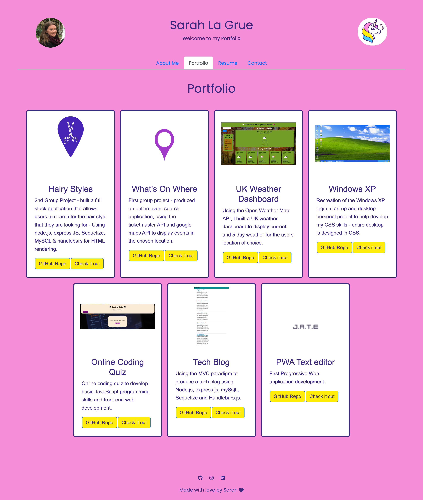

# 20 React: React Portfolio

Creation of a personal portfolio using the React framework.

---

**Table of Contents:**

* [Description](#description)
* [User Story](#user-story)
* [Acceptance Criteria](#acceptance-criteria)
* [Installation](#installation)
* [Testing](#testing)
* [Using the code](#using-the-code)
* [Portfolio deployment](#portfolio-deployment)
    * [Deployment Link](#deployment-link)
    * [Screenshot of application](#screenshot-of-deployed-application)
* [Usage](#usage)
* [License](#license) 
* [Questions](#questions)

---

## Description

A from scratch development of a perosnal portfolio using the React framework - key is to have a working navigation section that won't reload the whole page every time you access part of the navigation. Also using the react bootstrap framework to import elements into the pages such as forms etc.


## User Story


* AS AN employer looking for candidates with experience building single-page applications
* I WANT to view a potential employee's deployed React portfolio of work samples
* SO THAT I can assess whether they're a good candidate for an open position


## Acceptance Criteria


* GIVEN a single-page application portfolio for a web developer
* WHEN I load the portfolio
* THEN I am presented with a page containing a header, a section for content, and a footer
* WHEN I view the header
* THEN I am presented with the developer's name and navigation with titles corresponding to different sections of the portfolio
* WHEN I view the navigation titles
* THEN I am presented with the titles About Me, Portfolio, Contact, and Resume, and the title corresponding to the current section is highlighted
* WHEN I click on a navigation title
* THEN I am presented with the corresponding section below the navigation without the page reloading and that title is highlighted
* WHEN I load the portfolio the first time
* THEN the About Me title and section are selected by default
* WHEN I am presented with the About Me section
* THEN I see a recent photo or avatar of the developer and a short bio about them
* WHEN I am presented with the Portfolio section
* THEN I see titled images of six of the developer’s applications with links to both the deployed applications and the corresponding GitHub repositories
* WHEN I am presented with the Contact section
* THEN I see a contact form with fields for a name, an email address, and a message
* WHEN I move my cursor out of one of the form fields without entering text
* THEN I receive a notification that this field is required
* WHEN I enter text into the email address field
* THEN I receive a notification if I have entered an invalid email address
* WHEN I am presented with the Resume section
* THEN I see a link to a downloadable resume and a list of the developer’s proficiencies
* WHEN I view the footer
* THEN I am presented with text or icon links to the developer’s GitHub and LinkedIn profiles, and their profile on a third platform (Stack Overflow, Twitter)


Challenges in this project: getting used to the way pages and components are imported and exported and the overall structure of a react app. I have enjoyed using the react bootstrap components to create my app and the use of the react icons to link into the components.


## Installation

Start by downloading the code from the repository, then load in VS code, open a terminal and make sure you are in the project folder.
Initialise the code by typing into the terminal:
```bash
npm i
```

## Using the code

To initialise the code you will need to run the following commands in the terminal to run up the program:

- To get the code running locally you will need to enter into the terminal:
```bash
npm run start
```
and go to

```bash
localhost:3000
```

Once you have finished using the code, be sure to run *(ctrl+C)* or *(^C)* to close down the session.

The code files are fully commented, to explain the flow and logic of the code, so that others can work on this and expand on it too.


## Portfolio deployment.

### Deployment Link.

<a href="https://github.com/enigmawoman/20-react-myportfolio"><b>Deployed portfolio link</b></a>

### Screenshot of deployed application




## Usage

This code can be used as an example of how to build a web application with the MERN stack using the technologies layed out in the description, if you have any questions or suggestions, please let me know using the links in the [questions](#questions) section of this README.

## License

NA

## Questions

If you have any questions, reach out [@enigmawoman](https://github.com/enigmawoman)</br>


